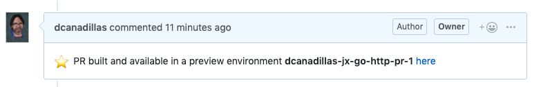
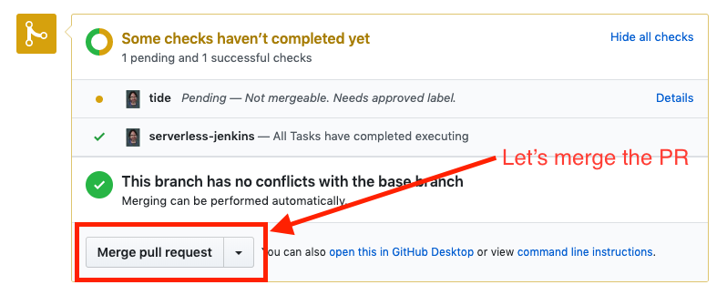

# Jenkins X introduction

[](https://console.cloud.google.com/cloudshell/open?git_repo=https://github.com/dcanadillas/jenkins-x-workshop&tutorial=JenkinsXLab.md)

[Jenkins X](https://jenkins-x.io/) is the Cloud Native implementation of Jenkins. By leveraging Kubernetes and using CRDs (Custom Resource Definitions) it allows you to execute your CI/CD pipelines with no expert Kubernetes knowledge required. It uses containers orchestration and development buildpacks to automate the development experience to deliver your applications.

The following concepts and components are essential in order to understand Jenkins X capabilities:

* [GitOps](https://www.weave.works/technologies/gitops/) promotions to promote your application
* [DevPods](https://jenkins-x.io/developing/devpods/) to provide development tools in sync with promotion environments
* [Build packs](https://jenkins-x.io/architecture/build-packs/) as development templates
* Powerful CLI to automate the CI/CD process and to provide Kubernetes tooling abstraction
* Automated [preview environments](https://jenkins-x.io/developing/preview/) to support pull or change requests
* [Jenkins X pipeline](https://jenkins-x.io/architecture/jenkins-x-pipelines/) engine for serverless capabilities (based on [Tekton CD](https://cloud.google.com/tekton/))

In this lab you will use Jenkins X as the Cloud Native CI/CD orchestrator to deploy a quickstart [Go application from a build pack](https://github.com/jenkins-x-buildpacks/jenkins-x-kubernetes/tree/master/packs/go) and use some of the Jenkins X features to work on a change request that needs to be delivered into production.

## What you’ll do

* Install Jenkins X in a GKE Cluster
* Use Kubernetes namespaces in GKE as deployment environments
* Create a Quickstart Project from a build pack
* Leverage Preview Environments for Pull Requests
* Promote your changes into Production

GitOps promotions is applied for all the development process to promote the application:

[](https://raw.githubusercontent.com/dcanadillas/jenkins-x-workshop/master/images/JXGitOps.png)

* By creating a Pull Request the preview chart included in the buildpack is applied and deployed in a namespace that Jenkins X creates automatically as Preview Environment
* When the pull request is merged (it is done automatically in serverless by using ChatOps in GitHub) Jenkins X deploys into Staging by changing the version in Staging Git repo and then deploying the application chart in the staging namespace in Kubernetes
* Once a promotion to Production is triggered (needs to be triggered manually as a production environment) Jenkins X creates a pull request in the production Git repo to change the version, merges it and then deploy the chart into Production namespace in Kubernetes.

> Note:
>     If no parameter is specified Jenkins X by default creates a namespace per environment in the same Kubernetes cluster (jx, jx-staging and jx-production). In this lab this default behaviour is used.But a more real scenario would be using different K8s clusters per environment. This can be done in Jenkins X by using ‘--remote-environments’ parameter when creating the cluster or just ‘--remote’ when editing current environments. This is possible by the Multi-cluster capabilities of Jenkins X_

# Setup
This lab will create a Kubernetes cluster using Google Container Engine (GKE) and will require connections to GitHub repositories. The following sections detail all the requirements you need in order to follow the Jenkins X lab.

## What you'll need
To complete this lab, you’ll need:
* A GitHub account to use for the Jenkins X configuration flow. This is mandatory, if you don't have one or you do not want to mess up your existing one, go now and [create one](https://github.com/join)
* Access to a standard internet browser (Chrome browser recommended).
* Time. It shouldn't take you more than 1,5 hours to read and finish everything (including setup), but depends on interruptions and how you plan your time. Then, plan your schedule so you have time to complete the lab. Follow the Google Cloud Shell tutorial in the right side of your screen 
* You need a Google Cloud Platform account or project. You can use a [Free Tier Google account to create one](https://cloud.google.com/free/) or your own. 
* If you already have your own GCP account, bear in mind that charges may apply if Free Tier is expired

## Google Cloud Shell tutorial

This lab tutorial is designed to be followed by [Cloud Shell Tutorials](https://cloud.google.com/shell/docs/tutorials), so you will be able to open by clicking the following button:

[](https://console.cloud.google.com/cloudshell/open?git_repo=https://github.com/dcanadillas/jenkins-x-workshop&tutorial=JenkinsXLab.md#'Install the JenkinsX jx binary')

You can also follow by reading this Markdown document and executing the commands in your Google Cloud Shell:

* Open your [Google Console](https://console.cloud.google.com)
* Select or create the project where you are going to work in Google Cloud Platform
  
  
* Open Google Cloud Shell terminal
  
  
* Work in your terminal and check that you are in the right project
  
  

If you follow this lab from the Google Cloud Shell Tutorial, you can copy all the commands to the shell just by clicking the copy icon.

<walkthrough-cloud-shell-icon>
</walkthrough-cloud-shell-icon>

# Install the Jenkins X CLI binary

There is a script included in this repo to install Jenkins X CLI depending on your platform (Linux or MacOS) and the Jenkins X distribution (CloudBees or OSS). For this lab we are using Jenkins OSS, so just execute the following to install CLI version 2.0.643:

```bash
./install-jx.sh -v 2.0.643
```

Output (do not copy)

```
Installing Jenkins X OSS version 2.0.643.

You are installing Jenkins X in: 

ProductName:    Mac OS X
ProductVersion: 10.14.6
BuildVersion:   18G87
Downloading and installing binary...

  % Total    % Received % Xferd  Average Speed   Time    Time     Time  Current
                                 Dload  Upload   Total   Spent    Left  Speed
100   613    0   613    0     0   1532      0 --:--:-- --:--:-- --:--:--  1536
  0 62.9M    0     0    0     0      0      0 --:--:-- --:--:-- --:--:--     0x LICENSE
x README.md
x changelog.md
100 62.9M  100 62.9M    0     0  13.6M      0  0:00:04  0:00:04 --:--:-- 17.1M

WARNING: Failed to find helm installs: running helm list --all --namespace cbcore: failed to run 'helm list --all --namespace cbcore' command in directory '', output: 'Error: could not find a ready tiller pod'
WARNING: Failed to get helm version: failed to run 'helm version --short' command in directory '', output: 'Client: v2.13.1+g618447c
Error: could not find a ready tiller pod'
NAME               VERSION
jx                 2.0.643
Kubernetes cluster v1.12.7-gke.25
kubectl            v1.14.1
git                2.21.0
Operating System   Mac OS X 10.14.6 build 18G87

        Jenkins X cli is already installed in "/usr/local/bin/jx"

Activating the Jenkins X Profile
```

If you want to work with the CloudBees Jenkins X Distribution, you can do it by:

```bash
./install-jx -c
```

You can find also the [manual steps to install Jenkins X CLI](https://jenkins-x.io/getting-started/install/) in Jenkins X documentation

# Create a Cluster

We are going to create a Kubernetes cluster with a Jenkins X platform deployed using the Jenkins X CLI. You will see that having a ready CI/CD Cloud Native platform from scratch is just a matter of minutes by executing some easy commands from the CLI.

## Prepare the environment
Make sure the Google Cloud project you're working on is the one selected in the Cloud Web Console. This should be the case if you opened Cloud Shell with the right project selected:

```bash
gcloud config list project
```

Output (do not copy)
```
[core]
project = <your-project-id>
Your active configuration is: [cloudshell-30655]
```

If the output is not showing the proper project id, get it from the Google Console top menu and set it up with the following command:

```bash
gcloud config set project <your-project-id>
```

Now that your project ID is set, export the value to a shell variable for later use:

```bash
export PROJECT_ID=$(gcloud config get-value project)
```

## Create the cluster and install Jenkins X

Let's create a GKE cluster to host Jenkins X. To create the cluster, run the jx tool with the following options, substituting the zone for one that's more suitable to you depending on your physical location:

```bash
jx create cluster gke --no-tiller --skip-login --default-admin-password=admin --project-id=${PROJECT_ID} --cluster-name=jenkins-x-lab --zone=europe-west1-d --version=2.0.330
```

This command is interactive; it will guide you through creating a cluster on GKE by prompting you to answer some questions. Read on to know how to continue.

### Missing Dependencies

The jx command will attempt to locate any required dependencies first (particularly, Helm), if it discovers that some are missing (it will ask you to install helm, for example) it will prompt to install them for you in the ~/.jx/bin folder. Just answer yes for jx to install whatever dependencies are required.

### Configure you cluster

Follow the prompt to provide the following answers:
* Google Cloud Machine Type: n1-standard-2
* Minimum number of Nodes: 4
* Maximum number of Nodes: 6
* Would you like use preemptible VMs: N
* Would you like to access Google Cloud Storage / Google Container Registry: Y
* Would you like to enable Cloud Build, Container Registry & Container Analysis APIs:  Y
* Would you like to enable Kaniko for building container images: Y

Now jx is using the Google Cloud SDK to create a GKE cluster with the provided parameters. It will take some time before continuing with the configuration (up to five minutes), and will output something like this:

Output (do not copy)

```
INFO[0244] Creating cluster...
```

### GitHub Connectivity and default workload

Once the cluster is created, the jx execution continues and you will be prompted for some configuration options. There will be some delays between prompts when the jx command proceeds with different installation actions; just follow these answers for the different steps and you should be good to go:
1. Select Jenkins installation type:  **Serverless Jenkins X Pipelines with Tekton**
2. Please enter the name you wish to use with git: **enter your GitHub user as Git user**
3. Please enter the email address you wish to use with git: **enter your GitHub email as Git email address**
4. No existing ingress controller found in the kube-system namespace, shall we install one? **Y**
5. Domain **<your-ip>**.nip.io **Accept the proposed domain by pressing Enter**
6. Would you like to enable Long Term Storage? A bucket for provider gke will be created (Y/n) **Y**
7. GitHub user name: **enter your GitHub username**
8. API Token: **copy here the API Token generated in the GitHub page presented to you when you followed the suggested URL link in the terminal**
9. Do you wish to use GitHub as the pipelines Git server: **Yes**
10. API Token: **copy here the API Token generated in the GitHub page presented to you when you followed the suggested URL link in the terminal. Be careful, this is a new API token, different from the previous one**.
Now the installer will take a bit of time before continuing with the next steps.
11. Pick default workload build pack:   select the option **Kubernetes Workloads: Automated CI+CD with GitOps Promotion**
12. Select the organization where you want to create the environment repository: **select here the GitHub organization you have already configured**

> **Note:** the nip.io service you just used is just a way to have a static domain based on your IP.


The jx command should exit successfully showing an output similar to this:

(Output)

```
Jenkins X installation completed successfully

        ********************************************************
             NOTE: Your admin password is: admin
        ********************************************************


Your Kubernetes context is now set to the namespace: jx
To switch back to your original namespace use: jx namespace default
Or to use this context/namespace in just one terminal use: jx shell
For help on switching contexts see: https://jenkins-x.io/developing/kube-context/

To import existing projects into Jenkins:       jx import
To create a new microservice from a quickstart: jx create quickstart
Fetching cluster endpoint and auth data.
kubeconfig entry generated for jenkins-x-lab.
Context "gke_javiercm-jx_europe-west1-d_jenkins-x-lab" modified.
NAME          HOSTS                                  ADDRESS          PORTS   AGE
chartmuseum   chartmuseum.jx.104.155.99.229.nip.io   104.155.99.229   80      3m40s
deck          deck.jx.104.155.99.229.nip.io          104.155.99.229   80      3m40s
hook          hook.jx.104.155.99.229.nip.io          104.155.99.229   80      3m39s
monocular     monocular.jx.104.155.99.229.nip.io     104.155.99.229   80      3m41s
nexus         nexus.jx.104.155.99.229.nip.io         104.155.99.229   80      3m40s
tide          tide.jx.104.155.99.229.nip.io          104.155.99.229   80      3m40s
```

Note the admin password shown by the end of the installation as you'll be using it afterwards (it should be admin).


> **Note:** You can check the passwords of the installation process in the file ádminsecrets.yaml’ that is saved in the Jenkins X local configuration directory ‘$HOME/.jx’. Check the secrets by:
> 
> `cat ~/.jx/adminSecrets.yaml`

### What did Jenkins X just install?

Jenkins X installs different components in order to orchestrate Cloud Native CI/CD. These can be summarized conceptually as:
* Prow (Serverless Jenkins X): A webhook handler that listens to GitHub events and that uses ChatOps to trigger jobs to execute your pipeline
* Tekton: Using [tekton pipelines](https://github.com/tektoncd/pipeline) and Jenkins X controller a pipeline is decoupled into tasks and pipeline resources that are Kubernetes native objects
* Chartmuseum: Helm chart repository to publish different charts to be used during pipeline execution
* Nexus: Artifact cache management that can be required by some applications during the building or deployment
* Monocular: UI used for discovering and running Helm charts
The more detailed architecture of Jenkins X using Tekton (Serverless Jenkins X) can be described below:


This is deployed to different pods and services in our development ‘jx’ namespace. So, let's take a look at what got installed based on the previous architecture diagram:

```bash
kubectl -n jx get pods
```

Output (do not copy)

```
NAME                                             READY   STATUS    RESTARTS   AGE
crier-749f96fb4d-h8lgr                           1/1     Running   0          10m
deck-696f77d746-mgxzm                            1/1     Running   0          10m
deck-696f77d746-tk2ml                            1/1     Running   0          10m
hook-6d9859bb47-562hx                            1/1     Running   0          10m
hook-6d9859bb47-wzl95                            1/1     Running   0          10m
horologium-6bc57b5f9-m2nsp                       1/1     Running   0          10m
jenkins-x-chartmuseum-75d45b6d7f-k2rb9           1/1     Running   0          9m12s
jenkins-x-controllerbuild-5d957488fc-4nxz5       1/1     Running   0          9m10s
jenkins-x-controllerrole-567d98bcdb-rhbbs        1/1     Running   0          9m11s
jenkins-x-controllerteam-865b78fc69-jr6k8        1/1     Running   0          9m11s
jenkins-x-heapster-6586795784-7f2hz              2/2     Running   0          7m51s
jenkins-x-mongodb-696fdf64fc-768mp               1/1     Running   1          9m10s
jenkins-x-monocular-api-6b676d869-rv58f          1/1     Running   3          9m10s
jenkins-x-monocular-prerender-77f6cd8449-2dpv6   1/1     Running   0          9m10s
jenkins-x-monocular-ui-7b98595f74-bgvnb          1/1     Running   0          9m9s
jenkins-x-nexus-6ccd45c57c-5mnqh                 1/1     Running   0          9m9s
pipeline-5f85b8df5b-59d7c                        1/1     Running   0          10m
pipelinerunner-744d857549-dg8vr                  1/1     Running   0          10m
plank-8849d9d67-d7nl9                            1/1     Running   0          10m
sinker-85ff54bd9b-pmrlv                          1/1     Running   0          10m
tekton-pipelines-controller-77cd668ddc-5vnjc     1/1     Running   0          10m
tekton-pipelines-webhook-5c6f475d75-twtdb        1/1     Running   0          10m
tide-5f8fb5964c-bgjn4                            1/1     Running   0          10m
```

Jenkins X also created several secrets that it's using to authenticate to different services. You can have a look at them by running kubectl get secrets and observing how, for instance, there's a kaniko-secret stored to be used with Kaniko.
The jx command can also give you entry URLs for different services deployed by Jenkins X:

```bash
jx get urls
```

Output (do not copy)

```
deck                    http://deck.jx.35.187.61.201.nip.io
hook                    http://hook.jx.35.187.61.201.nip.io
jenkins-x-chartmuseum   http://chartmuseum.jx.35.187.61.201.nip.io
jenkins-x-monocular-api http://monocular.jx.35.187.61.201.nip.io
jenkins-x-monocular-ui  http://monocular.jx.35.187.61.201.nip.io
nexus                   http://nexus.jx.35.187.61.201.nip.io
tide                    http://tide.jx.35.187.61.201.nip.io
```

Note the deck URL that corresponds to Prow as we'll be using it to check that we're properly triggering  pipelines from GitHub events.
It is also now a good moment to have a look at how Jenkins X has created the environments and corresponding GitOps git repos,  as well as a default promotion strategy:

```bash
jx get environments
```

Output (do not copy)

```
NAME       LABEL       KIND        PROMOTE NAMESPACE     ORDER CLUSTER SOURCE                                                                       REF PR
dev        Development Development Never   jx            0
staging    Staging     Permanent   Auto    jx-staging    100           https://github.com/dcanadillas-kube/environment-jenkins-x-lab-staging.git
production Production  Permanent   Manual  jx-production 200           https://github.com/dcanadillas-kube/environment-jenkins-x-lab-production.git
```

Note the following details in the PROMOTE column:
* Development follows a **Never** promotion strategy, because we're not actually deploying anything and you're working locally.
* Staging follows a default **Auto** promotion strategy, meaning that any merge performed on the application's repo master branch will automatically deployed as a new version to staging.
* Production follows a **Manual** promotion strategy, meaning that you will use a jx promotion command to promote your staging application version into production.

SOURCE column reflects the corresponding environment configuration git repo.

# Create a Quickstart Project

Quickstarts are very basic pre-made applications you can start a project from, instead of creating a project from scratch. You can create new applications from a list of curated Quickstart applications via the jx create quickstart command.
Let's do that, but before creating our quickstart application create first a directory to store your work:

```bash
mkdir -p ~/jx-gke-lab && cd ~/jx-gke-lab
```

The following set of commands will be run from this directory.

Create now a Golang Quickstart with the following command:

```bash
jx create quickstart -l go -f http -p jx-go-http -b
```

Output (do not copy)

```
About to create repository jx-go-http on server https://github.com with user dcanadillas

Creating repository dcanadillas/jx-go-http
Pushed Git repository to https://github.com/dcanadillas/jx-go-http

Creating GitHub webhook for dcanadillas/jx-go-http for url http://hook.jx.35.187.61.201.nip.io/hook

Watch pipeline activity via:    jx get activity -f jx-go-http -w
Browse the pipeline log via:    jx get build logs dcanadillas/jx-go-http/master
You can list the pipelines via: jx get pipelines
When the pipeline is complete:  jx get applications

For more help on available commands see: https://jenkins-x.io/developing/browsing/
```

Note that your first pipeline may take a few minutes to start while the necessary images get downloaded!

Here's a brief explanation of what you just run:
* -l go will filter the list of available quickstarts to a specific language - Go in this case -.
* -f http will filter quickstarts in the previously selected language which name contains the string http
* -p jx-go-http will set jx-go-http as the application project name (application and git repo name). 
* -b launches the command in batch mode, so you do not need to interactively answer any questions

> **Note:** You can run the previous command without the ‘-b’ option (non-batch), so it uses the interactive mode. In this case you don’t need to use ‘-p jx-go-http’. The command would be like:
> 
> `$> jx create quickstart -l go`
> 
> In interactive mode you would be asked for the following:
> * **Git user name?** select your GitHub username that is going to develop and be the owner of the repo. This GitHub user can be different from the pipeline GitHub username that you used on Jenkins installation
> * **Which organisation do you want to use?** The GitHub organization where you want the repository to be created
> * **Enter the new repository name:** Enter a repository name that is going to be created. This step is the one that is selected with the -p option used in batch-mode
> **Would you like to initialise git now? (Y/n)** Type Y (or press Enter) to initialize git in the directory where the local repo is create
> **Commit message:  (Initial import)** Press Enter to select the default message “Initial import” or just type your first commit message of the repo to be created

By executing this command, Jenkins X has performed a set of actions belonging to this specific quickstart (you can follow the steps in the output the previous command generated):
* Based on the language selected it recognizes using [Draft](https://draft.sh/) the specific Jenkins X [buildpack](https://jenkins-x.io/architecture/build-packs/).
* Based on this buildpack it creates a new application in a local sub directory. 
* Adds your source code into a local git repository.
* Adds the following default files:
  * Dockerfile to build your application as a docker image.
  * `jenkins-x.yml` file implementing a Jenkins X CI/CD pipeline.
  * Helm chart to run your application inside Kubernetes (inside `charts/` directory).
  * Preview chart with dependencies to create preview environments (also inside `charts/` directory).
* Creates a remote git repository on a git service, such as GitHub (the one you just configured)
* Pushes your local code to the remote git service.
* Registers a webhook on the remote git repository.
* Triggers the pipeline for the first time.

Now run the following command to monitor the pipeline activity in watch mode (`-w` option):

```bash
jx get activity -f jx-go-http -w
```

Output (do not copy)

```
STEP                                               STARTED AGO DURATION STATUS
dcanadillas/jx-go-http/master #1                            2s          Running
  from build pack                                           2s          Running
    Credential Initializer 4xf98                            2s       0s Succeeded
    Working Dir Initializer G9qw7                                       Pending
    Place Tools                                                         Pending
    Build Container Build                                               Pending
    Build Make Build                                                    Pending
    Build Post Build                                                    Pending
    Git Merge                                                           Pending
    Git Source Dcanadillas Jx Go Http Master Wdbjl                      Pending https://github.com/dcanadillas/jx-go-http
    Promote Changelog                                                   Pending
    Promote Helm Release                                                Pending
    Promote Jx Promote                                                  Pending
    Setup Jx Git Credentials                                            Pending
dcanadillas/jx-go-http/master #1                            3s          Running
  from build pack                                           3s          Running
    Credential Initializer 4xf98                            3s       0s Succeeded
    Working Dir Initializer G9qw7                           1s       0s Succeeded
    Place Tools                                                         Pending
    Build Container Build                                               Pending
    Build Make Build                                                    Pending
    Build Post Build                                                    Pending
    Git Merge                                                           Pending
    Git Source Dcanadillas Jx Go Http Master Wdbjl                      Pending https://github.com/dcanadillas/jx-go-http
    Promote Changelog                                                   Pending
    Promote Helm Release                                                Pending
    Promote Jx Promote                                                  Pending
    Setup Jx Git Credentials                                            Pending

...
```

Up to this point, you didn't check what the pipeline you just launched is doing. However, you should see the steps now being executed and the status of the different steps. 
Press **CTRL+C** to exit the activity view watch mode.

To browse the pipeline detailed log, run the following jx command:

```bash
jx get build logs
```

When the pipeline is complete (meaning all activities have a Succeeded/Failed status), you can have a look at your deployed applications versions  in Jenkins X by typing:

```bash
jx get version
```

Output (do not copy)

```
APPLICATION STAGING PODS URL
jx-go-http  0.0.1   1/1  http://jx-go-http.jx-staging.35.187.61.201.nip.io
googlece33001_student@cs-6000-devshell-vm-cf22e372-df56-4e51-bb3c-7ebda2af30ed:~/jx-gke-lab/jx-go-http$
```

# Doing a pull request

Once we checked that our first 0.0.1 version is deployed into Staging, let’s change our application in a different git branch and create a pull request to merge into master.

## Creating the GitHub Pull Request

Let’s get into the local git repo:

```bash
cd ~/jx-gke-lab/jx-go-http
```

Then, create a new branch for the pull request and check it out from your Cloud Shell:

```bash
git checkout -b my-pr
```

Open the Cloud Shell editor and update the main.go file:

```bash
cloudshell edit main.go
```

The Cloud Shell editor should open the file, that you can now edit graphically.  Update line 10 so it the variable title has a new value. The new line should like like this:

        title := "Jenkins X golang http example by <your name>"

When done, press Ctrl + S (or Command + S if you're using a Mac).
Now, stage the change for commit and commit the change to GitHub:

```bash
git add main.go
git commit -m "New welcome message"
```

Finally, push the changes to GitHub:

```bash
git push --set-upstream origin my-pr
```

Now we are ready to create the Pull Request (PR). So, let’s use the GitHub web console to create the pull request with the changes you pushed from your “my-pr” branch:
* Go to https://github.com/<your_github_username>/jx-go-http
* Check that your changes are waiting for creating the PR and select “Compare & pull request” (DON’T FORGET TO SIGN IN INTO GITHUB!)
* Then edit your PR message (e.g. “New welcome message”)
* Check your changes 

Here you have some screenshots to see the process:


> **Note:** Instead of using GitHub web console you can also create the pull request directly from Jenkins X with the following command
> 
> `$> jx create pr -t “New welcome message” `
> 
> Open then the link that is the output of the command and you go directly to the pull request created.

## Preview the application and approve the Pull Request

Once the Pull Request is created on GitHub we sould use the Prow commands to approve the pull request via ChatOps, so then the merge and pipelines are triggered automatically once one of the approvers in the “OWNERS” file of the application repo select `/approve` or `/lgtm` (Looks Good to Me). 

The following actions happened automatically when we created the PR:
* An approval notifier is saying that “This PR is NOT APPROVED” and suggest some ChatOps commands that can be used from Prow
  

  
* Then, a size label is attached to the change proposed in the PR (size/XS) in this case


* After a minute more or less a Preview environment is created and deployed


Check the progress of the PR build:

```bash
jx get activity -f dcanadillas/jx-go-http/PR-1
```

Output (do not copy)

```
STEP                                                 STARTED AGO DURATION STATUS
dcanadillas/jx-go-http/PR-1 #1                            15m29s      57s Succeeded
  from build pack                                         15m29s      57s Succeeded
    Credential Initializer 96dnz                          15m29s       0s Succeeded
    Working Dir Initializer R2ngt                         15m28s       0s Succeeded
    Place Tools                                           15m27s       0s Succeeded
    Build Container Build                                 15m25s      17s Succeeded
    Build Make Linux                                      15m26s      10s Succeeded
    Git Merge                                             15m26s       4s Succeeded
    Git Source Dcanadillas Jx Go Http Pr 1 Ser V6bpx      15m26s       1s Succeeded https://github.com/dcanadillas/jx-go-http
    Postbuild Post Build                                  15m25s      18s Succeeded
    Promote Jx Preview                                    15m25s      53s Succeeded
    Promote Make Preview                                  15m25s      32s Succeeded
  Preview                                                 14m33s           https://github.com/dcanadillas/jx-go-http/pull/1
    Preview Application                                   14m33s           http://jx-go-http.jx-dcanadillas-jx-go-http-pr-1.35.189.194.245.nip.io
```

You can check the preview environment by:

```bash
jx get previews
```

Output (do not copy)

```
PULL REQUEST                                     NAMESPACE                      APPLICATION
https://github.com/dcanadillas/jx-go-http/pull/1 jx-dcanadillas-jx-go-http-pr-1 http://jx-go-http.jx-dcanadillas-jx-go-http-pr-1.35.189.194.245.nip.io
```

So, you can check the application preview environment by going to the previous URL in the output of ‘jx get previews’. There you should see your changes in Development to be merged into Master and then to be able to deploy a new version into Staging:



In this lab we didn’t configure a different GitHub user to act as “a bot” so you cannot approve your own PR with the `/approve` command of Prow. So, in this case we will close the PR manually to trigger the promotion pipeline into Staging:



> **Note:**
> 
> During the installation process you could have configured a different GitHub user for the “Pipeline Server”. This user then act as a “bot” to generate the comments automatically in the Pull Request to work with Prow.
> 
> Then, you could approve a pull request just by commenting “/approve” in the PR messages if you are one of the approvers defined in the repo `OWNERS` file.
> 

This should trigger the promotion pipeline into Staging. Let’s check the execution:

```bash
jx get activity -f jx-go-http -w
```

Output (do not copy)

```
dcanadillas/jx-go-http/master #2                           1m25s          Running Version: 0.0.2
  from build pack                                          1m25s          Running
    Credential Initializer Slgsg                           1m25s       0s Succeeded
    Working Dir Initializer B878d                          1m24s       0s Succeeded
    Place Tools                                            1m23s       0s Succeeded
    Build Container Build                                  1m22s      17s Succeeded
    Build Make Build                                       1m22s       9s Succeeded
    Build Post Build                                       1m21s      17s Succeeded
    Git Merge                                              1m22s       2s Succeeded
    Git Source Dcanadillas Jx Go Http Master R Tlsmg       1m22s       1s Succeeded https://github.com/dcanadillas/jx-go-http
    Promote Changelog                                      1m21s      23s Succeeded
    Promote Helm Release                                   1m21s      27s Succeeded
    Promote Jx Promote                                     1m21s          Running
    Setup Jx Git Credentials                               1m22s       2s Succeeded
  Promote: staging                                           45s      44s Succeeded
    PullRequest                                              45s      44s Succeeded  PullRequest: https://github.com/dcanadillas-kube/environment-jenkins-x-lab-staging/pull/2 Merge SHA: bfff9a3be0eef8d845256979d9aa89702e31afb4
    Update                                                    1s       0s Succeeded
    Promoted                                                  1s       0s Succeeded  Application is at: http://jx-go-http.jx-staging.35.189.194.245.nip.io
```

Once we check in the previous output that the Pull Request #2 is succeeded, we can see our new version deployed:

```bash
jx get version
```

Output (do not copy)

```
APPLICATION STAGING PODS URL
jx-go-http  0.0.2   1/1  http://jx-go-http.jx-staging.35.189.194.245.nip.io
```

Let’s check the application deployed into staging by:

```bash
jx open jx-go-http -e staging
```

If we open the output url shown from the previous output in a browser tab the new version 0.0.2 of the application with the changes is shown.

# Promote to Production

Let’s check the current releases that are deployed on the whole cluster:

```bash
jx get releases
```

Output (do not copy)

```sh
NAME            VERSION
jx-go-http        0.0.2
jx-go-http        0.0.1
```

And now let’s check current version deployed into staging

```bash
jx get version -e staging
```

Output (do not copy)

```sh
APPLICATION STAGING PODS URL
jx-go-http  0.0.2   1/1  http://jx-go-http.jx-staging.35.189.194.245.nip.io
```

Let’s say that we want to deploy version 0.0.2 into Production:

```bash
jx promote -a jx-go-http -e production -v 0.0.2
```

You may be asked for your GitHub credentials:
* Username for 'https://github.com': **Use your GitHub username**
* Password for 'https://<your_username>@github.com': **Use your API Token**
? Do you wish to use <previous_username>  as the user name to comment on issues **Press Enter for default value (Yes)**

The previous command is defined by different parameters:
* -a: The application to promote (jx-go-http in this lab)
* -e: The environment where the application is going to be promoted and deployed
* -v: The version of the application to promote/deploy

> **Note:** The promotion command can be executed with no parameters, so a wizard is going to ask about the actions to take from promotion taking the local repository
> 
> `$> jx promote `
> 
> ? Pick environment:  [Use arrows to move, space to select, type to filter]
   staging
> **production**
> ...

The promotion process takes different steps:
* Creates a PR in Production git repo (https://github.com/dcanadillas-kube/environment-jenkins-x-lab-production.git) to change the version in ‘env/requirements.yaml’ file
* Merges the PR to change the version in the Master branch of the Production repo
* Triggers a promotion pipeline build that deploys the application version (same as Production git repo) into Production namespace in Kubernetes

Once the promotion build pipeline finishes (you can check as previous steps with ‘jx get activity -f jx-go-http’), you can check that the 0.0.2 version of the app is deployed into Production:
And now let’s check current version deployed into different environments (staging and production):

```bash
jx get version
```

Output (do not copy)

```sh
APPLICATION    STAGING PODS URL                                                   PRODUCTION PODS URL
jx-go-http     0.0.2   1/1  http://jx-go-http.jx-staging.35.189.194.245.nip.ioo   0.0.2      1/1  http://jx-go-http.jx-production.35.189.194.245.nip.io
```


Congratulations! You have finished this lab.

# Cleaning Up

If you want to leave your GitHub as it is was before doing this lab, you just need to delete the repos jx created for you here:

```bash
jx delete repo \
-n environment-jenkins-x-lab-production \
-n environment-jenkins-x-lab-staging \
-n jx-go-http
```

When prompted, answer the following questions:

* Git user name **<your_github_username>**
* Are you sure you want to delete these all these repositories? **Y**

Output (do not copy)

```sh
WARNING: You are about to delete these repositories 'environment-jenkins-x-lab-production,environment-jenkins-x-lab-staging' on the Git provider. This operation CANNOT be undone!
? Are you sure you want to delete these all these repositories? Yes
Deleted repository <your_username>/environment-jenkins-x-lab-production
Deleted repository <your_username>/environment-jenkins-x-lab-staging
```
