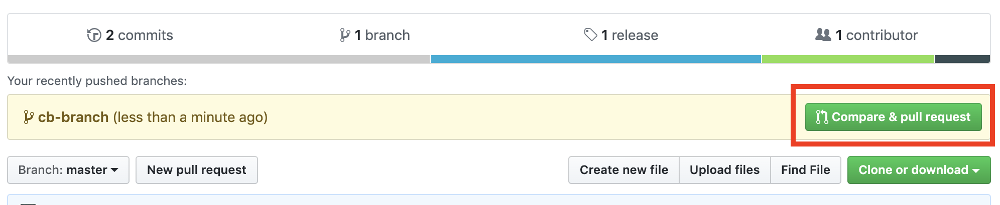
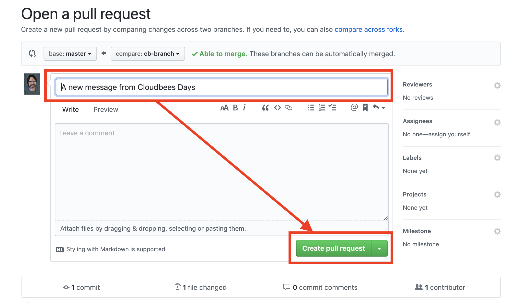

# Creating a pull request and preview environments

In this exercise we will change the message of our application created before and create a pull request for those changes.

First, we ensure we are on our project local repo directory:
```bash
cd ~/cloudbees_days/jx-workshop/jx-go
```
Let's create a branch where to create our pull request:
```bash
git checkout -b cloudbees-days
```
Now, let's change the message of the go application created before:

(oprtional): *If you are using the CloudShell tutorial you can use the editor at the left to edit the main.go file and change the message. Or you can change the file using Vim:*

```bash
vim main.go
```
To change the message in one line code:
```bash
sed 's/Hello\ from\:/Hello\ Madrid\ from\ CloudBees\:/g' main.go > main.go.tmp \
&& mv main.go.tmp main.go
```

Once we have our application with the new welcome message, let's commit and push our changes:
```bash
git commit -am " A new message for CloudBees Days"
git push origin cloudbees-days
```
So, now should be a pull request to create in our github repo. If we open the repo:

```bash
jx repo
```
From GitHub repo we click the *Compare and Pull Request*:



And then a message can be edited (let's use the default one) and create the pull request:

